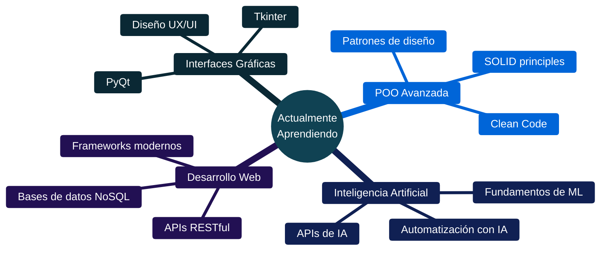

<div align="center">

<!-- Header animado -->


<!-- Typing animation -->
<p>
  <a href="https://git.io/typing-svg"></a>
</p>

<!-- Badges de perfil -->
<p>
  
  
  
</p>

</div>

---

## 👨‍💻 Sobre mí

```python
class Developer:
    def __init__(self):
        self.nombre = "Juan Camilo Guerrero"
        self.rol = "Desarrollador Full Stack en formación"
        self.lenguajes = ["Python", "JavaScript", "Java", "SQL"]
        self.enfoque = ["Backend", "Automatización", "Bases de datos"]
        self.idiomas = {"Español": "Nativo", "Inglés": "B2.2"}
        self.mentalidad = "Aprender haciendo, mejorar constantemente"
    
    def objetivos_2025(self):
        return [
            "Dominar POO y patrones de diseño",
            "Crear herramientas útiles con Python",
            "Explorar IA y automatización inteligente",
            "Contribuir a proyectos open source"
        ]

yo = Developer()
```

<div align="center">

**🧠 Aprendo constantemente** sobre programación, lógica y herramientas modernas  
**🚀 Construyo proyectos reales** para resolver problemas concretos  
**⚙️ Optimizo y automatizo** procesos para trabajar de forma más inteligente

</div>

---

## 🛠️ Stack Tecnológico

<div align="center">

### Lenguajes y Herramientas


### Tecnologías por categoría

<table>
<tr>
<td align="center" width="50%">

**Backend & Databases**


</td>
<td align="center" width="50%">

**Frontend**


</td>
</tr>
</table>

</div>

---

## 🚀 Proyectos Destacados

<div align="center">

<table>
<tr>
<td width="50%">

### 📦 Sistema de Inventario MySQL
**Python + MySQL**

Gestión completa de inventario con arquitectura relacional:
- ✅ Registro y seguimiento de productos
- ✅ Control de stock en tiempo real
- ✅ Consultas optimizadas con SQL
- ✅ Interfaz CLI funcional

**Tech Stack:** `Python` `MySQL` `SQL`

</td>
<td width="50%">

### 🧾 Sistema de Inventario JSON
**Python + Persistencia local**

Solución ligera sin dependencias externas:
- ✅ Gestión de clientes y productos
- ✅ Rastreo personalizable de inventario
- ✅ Sistema de envíos con timestamps
- ✅ Persistencia de datos con JSON

**Tech Stack:** `Python` `JSON` `datetime`

</td>
</tr>
<tr>
<td width="50%">

### 🎓 Modelo Predictivo de Deserción Estudiantil
**Machine Learning & Data Analysis**

Proyecto de análisis predictivo para instituciones educativas:
- ✅ Análisis de datos estudiantiles
- ✅ Predicción de riesgo de deserción
- ✅ Visualización de patrones y tendencias
- ✅ Modelo de ML con Python

**Tech Stack:** `Python` `Pandas` `Scikit-learn` `Machine Learning`

</td>
<td width="50%">

### 🧑‍🏫 Plataforma Educativa
**En desarrollo activo** 🚧

Plataforma completa para gestión educativa:
- 🔄 Panel administrativo para docentes
- 🔄 Constructor visual de contenido
- 🔄 Sistema de usuarios y roles
- 📋 Pasarela de pagos (planificado)

**Tech Stack:** `Python` `MySQL` `HTML/CSS/JS`

</td>
</tr>
</table>

</div>

---

## 📚 Aprendizaje Continuo

<div align="center">


<div align="center">


| 🖥️ **GUI Development** | 💻 **POO Avanzada** | 🧠 **IA & ML** | 🤖 **Automatización** |
|:---:|:---:|:---:|:---:|
| Tkinter, PyQt | Patrones de diseño | Fundamentos de ML | Scripts, bots |
| Diseño UX/UI | SOLID Principles | APIs de IA | Workflows |

</div>

---

## 🎯 Objetivos 2025

<div align="center">

| Área | Objetivo | Estado |
|------|----------|--------|
| 🐍 **Python** | Dominar POO y arquitectura de software | 🔄 En progreso |
| 🤖 **IA** | Integrar IA en proyectos prácticos | 📋 Planificado |
| 🌐 **Web** | Aprender frameworks modernos (Flask/Django) | 📋 Planificado |
| ⚙️ **DevOps** | CI/CD y automatización de deployments | 🔜 Próximamente |
| 🤝 **Open Source** | Contribuir a proyectos de la comunidad | 🔜 Próximamente |

**Leyenda:** 🔄 En progreso | 📋 Planificado | 🔜 Próximamente | ✅ Completado

</div>

---

## 💡 Filosofía de Desarrollo

<div align="center">

> ### _"Aprende creando. Mejora iterando."_ ⚙️

<table>
<tr>
<td align="center" width="33%">
<h3>📖</h3>
<strong>Aprendizaje Activo</strong>
<br><br>
<sub>Cada proyecto es una oportunidad<br/>para dominar nuevas tecnologías</sub>
</td>
<td align="center" width="33%">
<h3>🎯</h3>
<strong>Soluciones Reales</strong>
<br><br>
<sub>Código que resuelve problemas<br/>concretos y genera valor</sub>
</td>
<td align="center" width="33%">
<h3>⚡</h3>
<strong>Mejora Continua</strong>
<br><br>
<sub>Cada iteración es una versión<br/>más optimizada y eficiente</sub>
</td>
</tr>
</table>

</div>

---

## 📬 Conectemos

<div align="center">

¿Tienes un proyecto en mente? ¿Quieres colaborar? ¡Hablemos!

<br>

<a href="mailto:juancamiloguerrerocarrillo@gmail.com">
  
</a>

<a href="https://www.linkedin.com/in/juan-camilo-guerrero-carrillo-845881374">
  
</a>

<a href="https://portfolio-juan-camilo-guerrero.netlify.app/">
  
</a>

<a href="https://github.com/Juancamiloguerreroc">
  
</a>

<br><br>

```javascript
const contacto = {
  email: "juancamiloguerrerocarrillo@gmail.com",
  linkedin: "/juan-camilo-guerrero-carrillo",
  portfolio: "portfolio-juan-camilo-guerrero.netlify.app",
  disponibilidad: "Abierto a colaboraciones y nuevos proyectos",
  respuesta: "24-48 horas",
  idiomas: {
    español: "Nativo",
    inglés: "B2.2 - Upper Intermediate"
  }
};

```

</div>

---

<div align="center">

<!-- Footer con wave -->


<sub>💻 Construyendo el futuro, una línea de código a la vez</sub>

<br><br>


**⭐ Si te gusta mi trabajo, no olvides dejar una estrella en mis repositorios ⭐**

</div>
